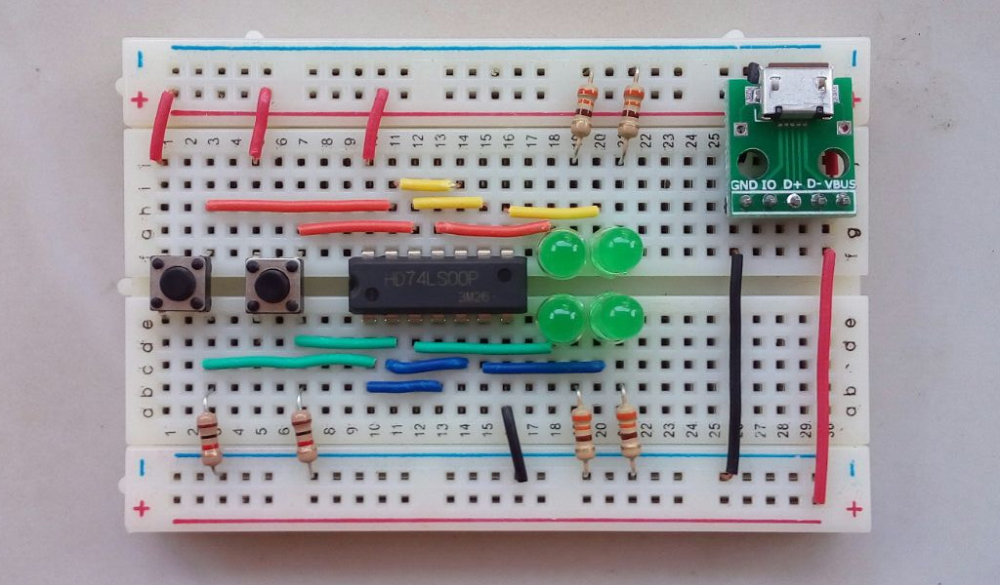

# KOM203 Rangkaian Digital

## Praktikum (2017--2020)

1. [Sistem bilangan](p01/p01-sistem-bilangan.md)    ([PDF](p01/p01-sistem-bilangan.pdf))
2. [Sistem komplemen](p01/p02-komplemen.md)         ([PDF](p01/p02-komplemen.pdf))
3. [IC logika: pengenalan](p03/p03-breadboard.md)   ([PDF](p03/p03-breadboard.pdf))
4. [IC logika: pengujian](p03/p04-logic-ic.md)      ([PDF](p03/p04-logic-ic.pdf))
5. [Verilog](p05/p05-verilog.md)                    ([PDF](p05/p05-verilog.pdf))
6. [K-Map](p06/p06-kmap.md)                         ([PDF](p06/p06-kmap.pdf))
7. Latihan UTS

8. [Adder](p08/p08-adder.md)                        ([PDF](p08/p08-adder.pdf))
9. [Adder 4-bit](p08/p09-adder.md)                  ([PDF](p08/p09-adder.pdf))
10. [ALU](p10/p10-alu.md)                           ([PDF](p10/p10-alu.pdf))
11. [Latch](p11/p11-latch.md)                       ([PDF](p11/p11-latch.pdf))
12. [Flip-flop](p12/p12-flip-flop.md)               ([PDF](p12/p12-flip-flop.pdf))
13. [Counter](p13/p13-counter.md)                   ([PDF](p13/p13-counter.pdf))
14. Latihan UAS

## Contoh Tugas

1. Pengujian IC logika <https://www.youtube.com/watch?v=krkMzSNBYw4>
2. Adder 4-bit <https://www.youtube.com/watch?v=3q1zuOPlB1M>
3. Counter 4-bit <https://www.youtube.com/watch?v=Fvq98-q7TJY>

