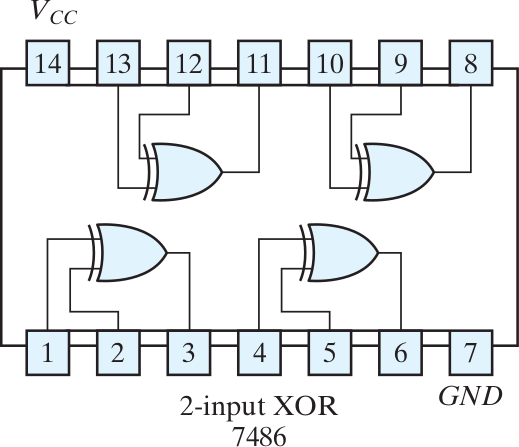
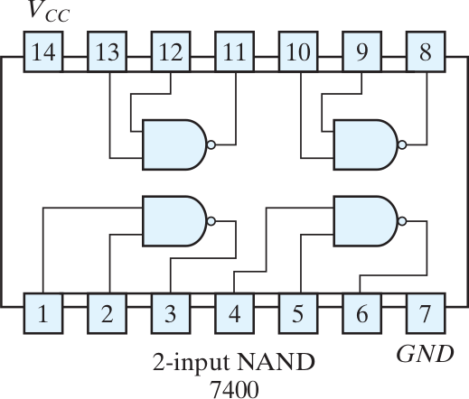

# *Breadboard*

## Koneksi internal *breadboard*

- untuk *prototyping*, tanpa harus menyolder komponen
- *power bus strip*: (atas bawah) terhubung secara horizontal
- *terminal strip*: terhubung secara vertikal

\center
{width=50%}

## Komponen elektronika

- LED: polar, kaki panjang positif
- resistor: non-polar
- kapasitor: non-polar dan polar
- *push button*: jika ditekan kaki kanan--kiri terhubung

\center

## Rangkaian LED sederhana

\center
{width=67%}

## Rangkaian LED dengan saklar

\center
{width=67%}

# IC Logika

## Daftar IC

- 7400 NAND (2x)
- 7402 NOR (2x)
- 7408 AND
- 7432 OR
- 7486 XOR
- 555 timer

## Pin IC logika

- pin 1 dimulai dari pojok kiri bawah *notch* IC

Pin         Fungsi
----        -------
14          Vcc
7           *ground*
1,2,3       *gate* 1
4,5,6       *gate* 2
8,9,10      *gate* 3
11,12,13    *gate* 4

## 7408 AND

\center
{width=50%}

## 7432 OR

\center
{width=50%}

## 7486 XOR

\center
{width=50%}

## 7400 NAND

\center
{width=50%}

## 7402 NOR

\center
{width=50%}

# Pengujian IC 7432

## Rangkaian *breadboard*

\center

## Catatan

- hati-hati saat memasang/melepas IC agar pin tidak bengkok
- saklar harus dihubungkan ke *ground* melalui *pull-down resistor* untuk menghindari *floating input*
- level tegangan *input* yang valid:
    - `LOW`: 0.0--0.8 V
    - `HIGH`: 2.0--5.0 V

## Tugas

- buat rangkaian pada *breadboard* untuk menguji IC 7432
- kumpulkan foto/*screenshot* hasil pengujian ke LMS

