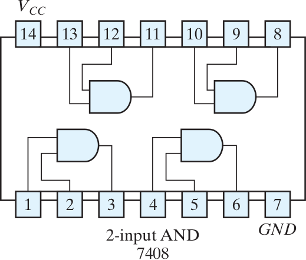
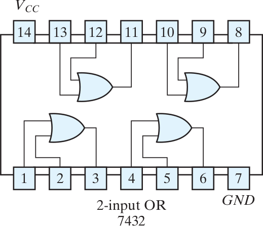
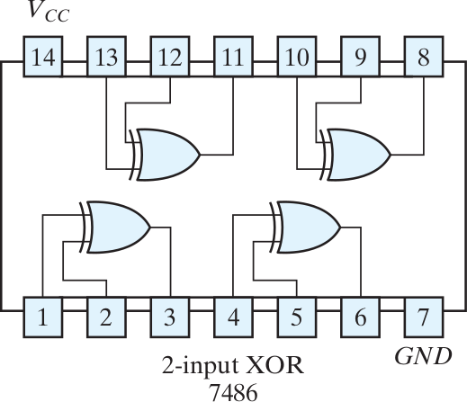
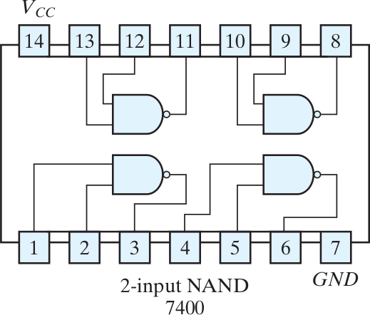
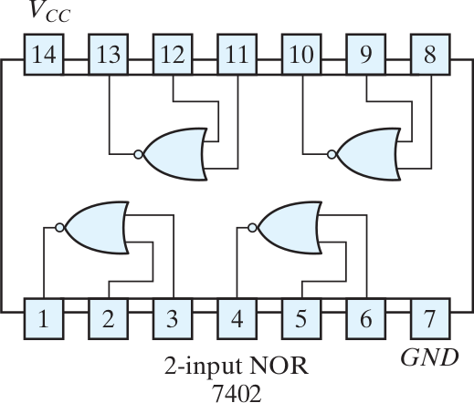
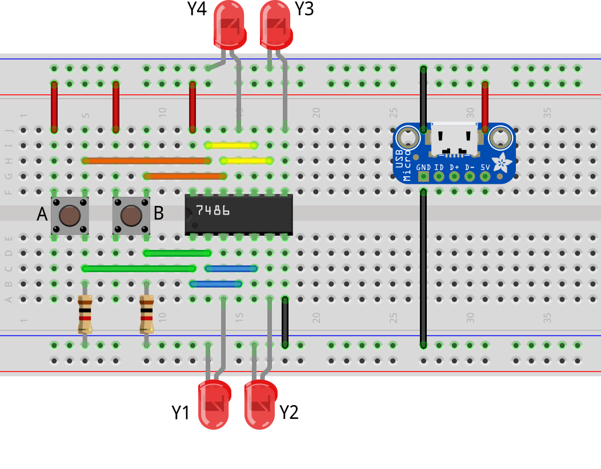
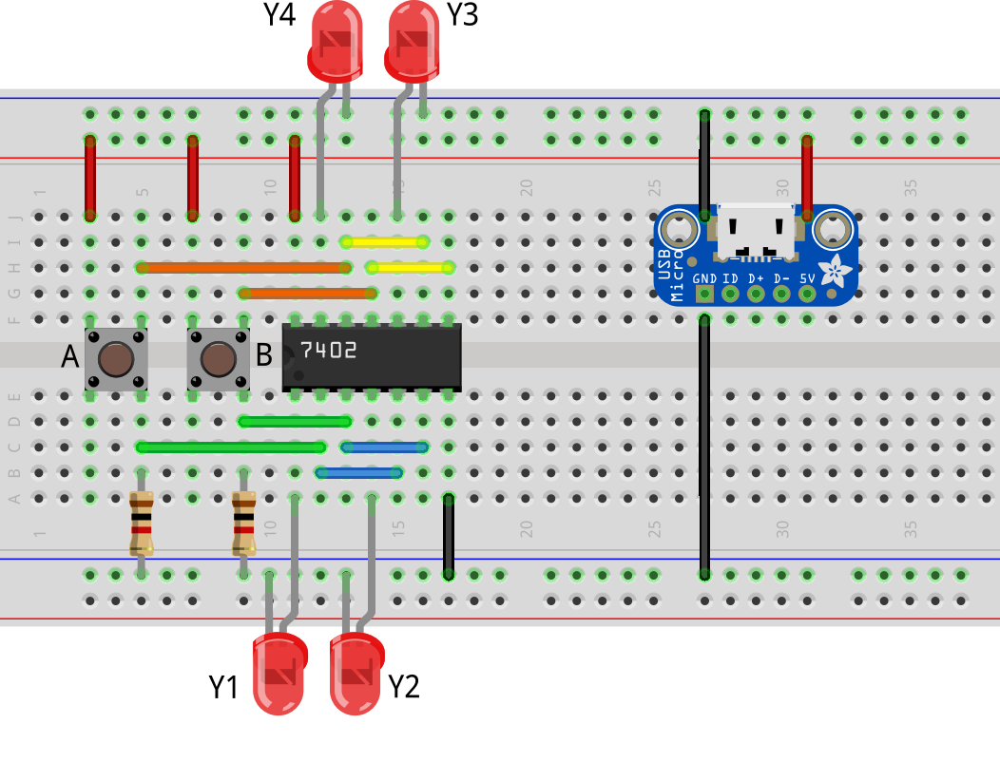

# Pin IC

## 7408 AND

\center
{width=50%}

## 7432 OR

\center
{width=50%}

## 7486 XOR

\center
{width=50%}

## 7400 NAND

\center
{width=50%}

## 7402 NOR

\center
{width=50%}

# Pengujian IC

## 7408 AND

\center

## 7432 OR

\center

## 7486 XOR

\center

## 7400 NAND

\center

## 7402 NOR

\center

# Tugas

## Video Pengujian

- Buat satu video pengujian untuk IC berikut:
    - 7408 AND
    - 7432 OR
    - 7486 XOR
    - 7400 NAND
    - 7402 NOR
- Unggah ke Youtube, kirimkan link-nya ke LMS
    - contoh: <https://youtu.be/ZikJOsYhEbQ>
    - tanpa musik, fokus ke rangkaian
    - nilai tambah jika ada penjelasan lisan/tulisan
    - paling lambat H+7 setelah praktikum
