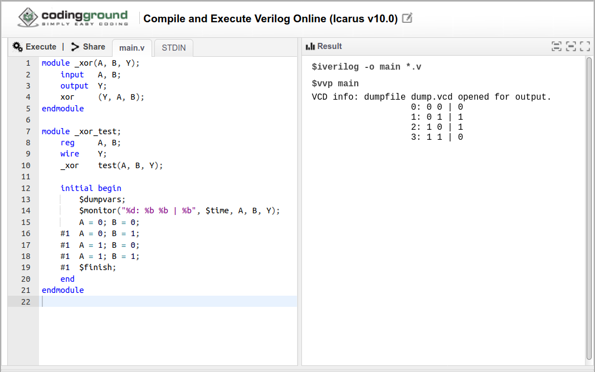

# Pengenalan

## Verilog

- *Hardware description language* (HDL)
- Untuk merancang dan mensintesis rangkaian digital skala besar

## Kompilasi Online

- <https://www.tutorialspoint.com/compile_verilog_online.php>
- Kode program ditulis pada panel sebelah kiri
- Jalankan dengan klik *Execute*
- Keluaran dapat dilihat pada panel sebelah kanan


## Kompilasi pada Geany

- Simpan dalam *file* berekstensi `.v`
- Kompilasi dengan `iverilog`
- Keluaran dapat dilihat dalam *waveform*
- Pada Geany:
    - *build*: `F9`
    - *execute*: `F5`
    - *waveform*: menu *Build -- Waveform*

## Contoh Kode: XOR

```verilog
/* xor.v */

module _xor(A, B, Y);
    input   A, B;
    output  Y;
    xor     (Y, A, B);
    // assign  Y = A ^ B;
endmodule
```

---

```verilog
module _xor_test;
    reg     A, B;
    wire    Y;
    _xor    test(A, B, Y);

    initial begin
        $dumpvars;
        $monitor("%d: %b %b | %b", $time, A, B, Y);
        A = 0; B = 0;
    #1  A = 0; B = 1;
    #1  A = 1; B = 0;
    #1  A = 1; B = 1;
    #1  $finish;
    end
endmodule
```

## Keluaran

```
VCD info: dumpfile dump.vcd opened for output.
0: 0 0 | 0
1: 0 1 | 1
2: 1 0 | 1
3: 1 1 | 0
```


---




# Sintaks

## Deklarasi modul

- `module`{.verilog}
- `endmodule`{.verilog}
- `input`{.verilog}: masukan
- `output`{.verilog}: keluaran
- `wire`{.verilog}: koneksi internal

## *Gate*

- `not`{.verilog}
- `and`{.verilog}
- `or`{.verilog}
- `xor`{.verilog}
- `nand`{.verilog}
- `nor`{.verilog}
- `xnor`{.verilog}

## *Assignment*

- `assign`{.verilog}
- operator *bitwise*:
    - `~`{.verilog}: NOT
    - `&`{.verilog}: AND
    - `|`{.verilog}: OR
    - `^`{.verilog}: XOR
- operator *logical*:
    - `!`{.verilog}: NOT
    - `&&`{.verilog}: AND
    - `||`{.verilog}: OR

## Pengujian

- `reg`{.verilog}: masukan
- `wire`{.verilog}: keluaran
- `initial`{.verilog}
- `begin`{.verilog}
- `end`{.verilog}
- `#delay`{.verilog}

## Sistem

- `$dumpvars`{.verilog}: aktifkan keluaran variabel
- `$monitor`{.verilog}: cetak variabel jika berubah nilainya
- `$time`{.verilog}: nilai waktu simulasi saat ini
- `$finish`{.verilog}: mengakhiri simulasi

# Latihan

## Latihan Soal di Buku

Kerjakan soal nomor:

- 3.31(a,b)
- 3.32(a,b)
- 3.34
- 3.39
