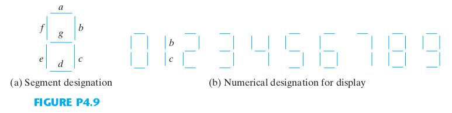
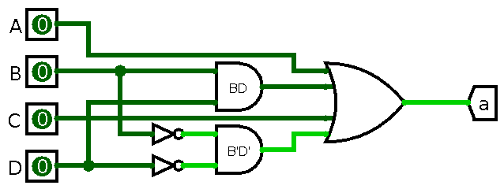
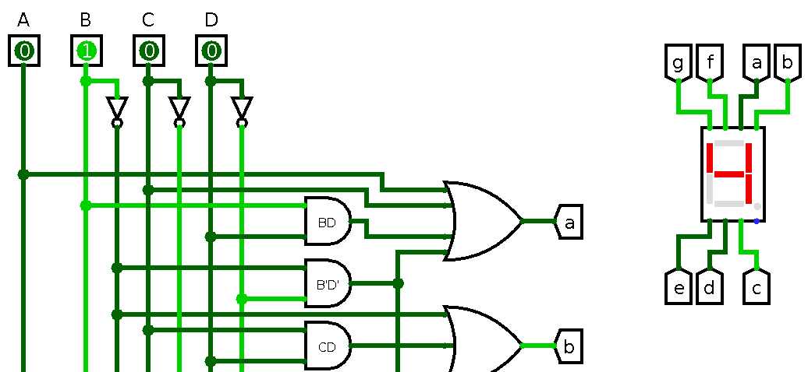

# K-Map

## Kasus: Dekoder BCD ke 7-Segmen

- Masukan: BCD 4-bit ($A, B, C, D$)
- Keluaran: 7 lampu LED ($a,b,c,d,e,f,g$)
- Buat tabel kebenaran tiap lampu
- Sederhanakan dengan *k-map*
    - manfaatkan kondisi *don't care* untuk masukan invalid

{width=75%}

## Contoh: Tabel Kebenaran $F_a$

$A$ $B$ $C$ $D$ $F_a$
--- --- --- --- -----
0   0   0   0   1
0   0   0   1   0
0   0   1   0   1
0   0   1   1   1
0   1   0   0   0
0   1   0   1   1
0   1   1   0   1
0   1   1   1   1
1   0   0   0   1
1   0   0   1   1
... ... ... ... X

## Contoh: K-Map $F_a$

\centering
\begin{karnaugh-map}[4][4][1][$CD$][$AB$]
    \minterms{0,2,3,5,6,7,8,9}
    \indeterminants{10,11,12,13,14,15}
    % \terms{10,11,12,13,14,15}{X}
    \implicant{12}{10}
    \implicant{3}{10}
    \implicant{5}{15}
    \implicantcorner
\end{karnaugh-map}

$F_a = A + C + BD + B'D'$

# Implementasi

## Implementasi Dua-Level: AND--OR

{width=75%}

# Tugas

## K-Map dan Implementasi Logisim

- Tulis di kertas k-map untuk tiap fungsi di atas
    - per kelompok, kumpulkan di akhir praktikum
- Implementasikan tiap fungsi pada Logisim
    - per kelompok, langsung dinilai oleh asprak

## Contoh Implementasi

{width=100%}
