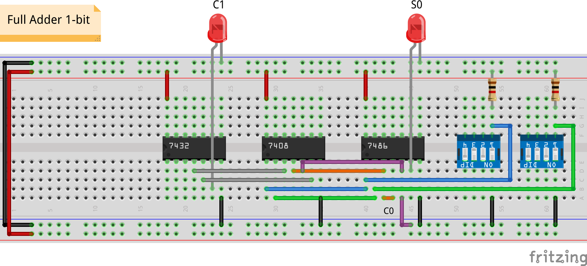

# Half Adder

## Half Adder

- $[C_o,S] = A + B$
    - masukan: $A$, $B$
    - keluaran: *carry out*, *sum*

 $A$     $B$     $C_o$   $S$
-----   -----   ------- -----
0       0       0       0
0       1       0       1
1       0       0       1
1       1       1       0

## Simulasi

{width=50%}

## Implementasi

# Full Adder

## Full Adder

- $[C_o,S] = C_i + A + B$
    - masukan: *carry in*, $A$, $B$
    - keluaran: *carry out*, *sum*

 $C_i$   $A$     $B$     $C_o$   $S$
------  -----   -----   ------- -----
0       0       0       0       0
0       0       1       0       1
0       1       0       0       1
0       1       1       1       0
1       0       0       0       1
1       0       1       1       0
1       1       0       1       0
1       1       1       1       1

## Simulasi

{width=90%}

## Implementasi

# Tugas

## Full Adder 2-bit

- Rancang rangkaian *full adder* 2-bit pada Logisim
    - dinilai langsung oleh asprak pada saat praktikum

<!--
- Rancang rangkaian *full adder* 2-bit pada Logisim dan Fritzing
- Beri label yang berisi nama dan NIM anggota kelompok
- Kumpulkan di LMS berupa dua *screenshot* dalam format `png`
- Paling lambat H+2

**Tips**: berikan nomor pin untuk tiap *gate* pada rancangan Logisim
untuk mempermudah memindahkan rancangan ke *breadboard*.
-->
