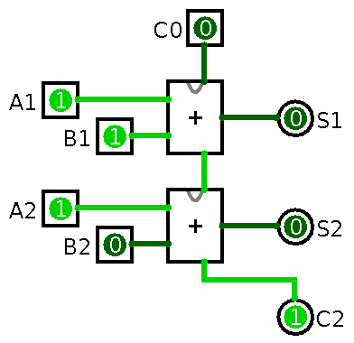

# Simulasi

## Full Adder 1-Bit

{width=90%}

## Full Adder 1-Bit (IC)

{width=60%}

Menu *Project* -- *Edit Circuit Appearance*

## Adder 2-Bit

{width=35%}

## Adder 4-Bit

{width=35%}

## Adder 4-Bit (IC)

{width=50%}

## Adder 4-Bit Test

{width=80%}

# Implementasi

## Full Adder 1-Bit

## Adder 2-Bit

## Adder 4-Bit

{width=96%}

# Tugas

## Video Demo

- Dua kelompok
    - 1--2, 3--4, ...
- Buat video demo pengujian adder 4-bit
    - contoh: <https://youtu.be/wvJc9CZcvBc?t=742>
    - fokus ke rangkaian, tanpa musik
    - upload ke Youtube, submit *link*-nya ke LMS
    - paling lambat H+7

<!--

## Laporan Adder 2-bit

- Buat laporan untuk rangkaian adder 2-bit
    - simulasi Logisim
    - skema breadboard
    - implementasi breadboard (foto)
    - pembahasan, penutup
- Kumpulkan ke email asprak, cc: <auriza@apps.ipb.ac.id>
    - paling lambat H+7

-->
