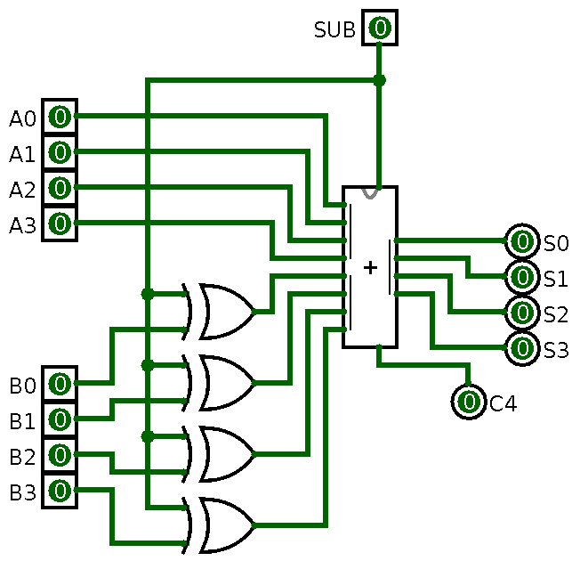
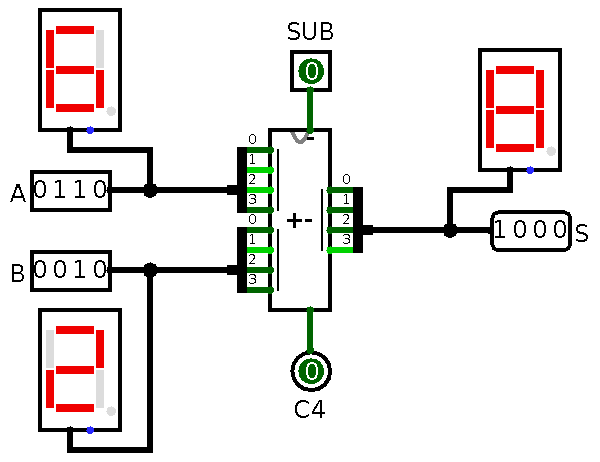
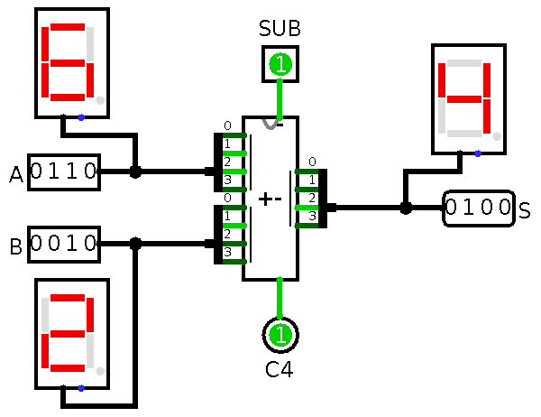
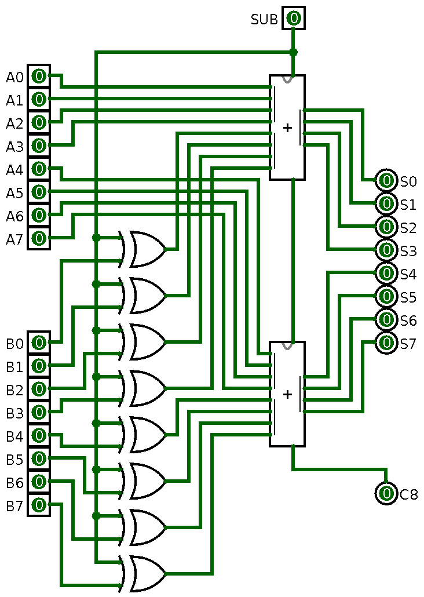
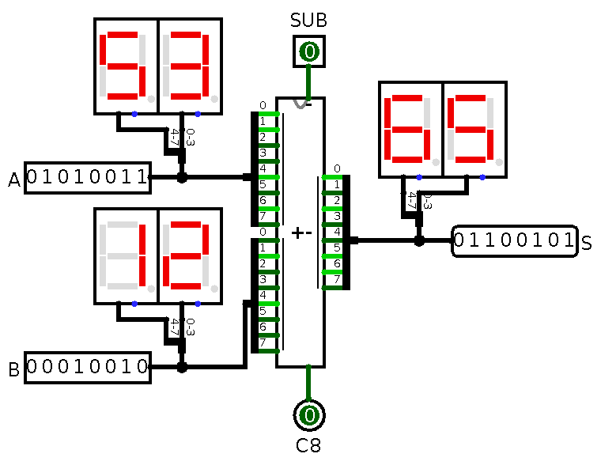
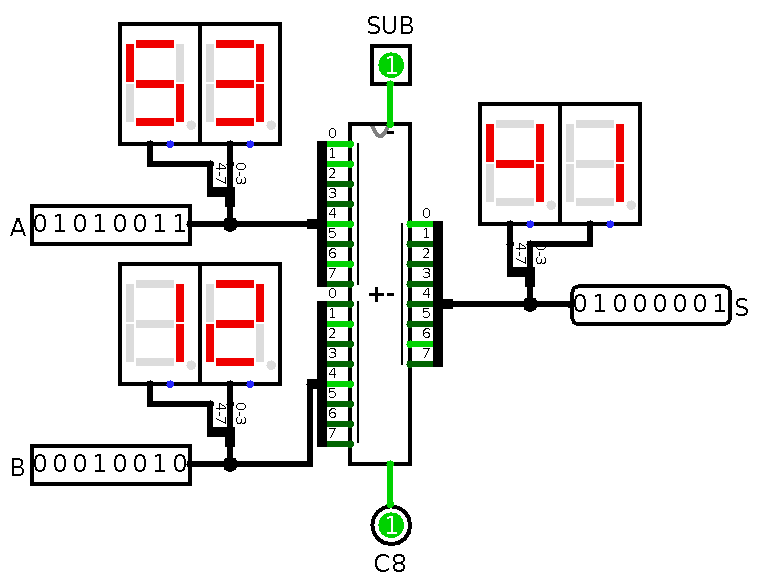
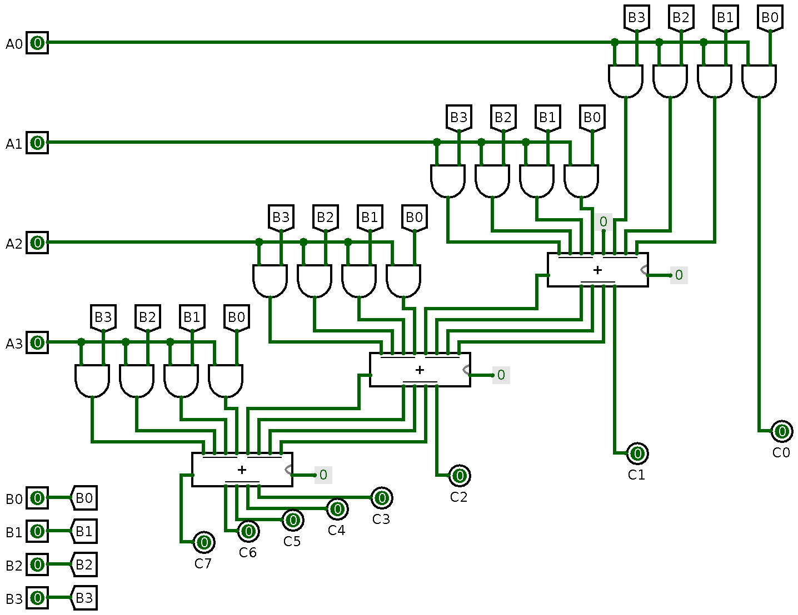
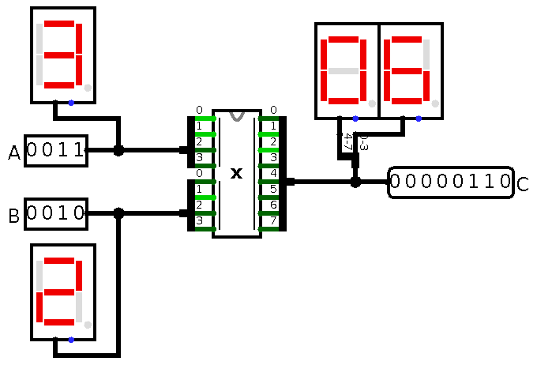

# Adder-Subtractor 4-Bit

## Adder-Subtractor 4-Bit

{height=90%}

## Adder-Subtractor 4-Bit Test

{height=80%}

## Adder-Subtractor 4-Bit Test

{height=80%}

# Adder-Subtractor 8-Bit

## Adder-Subtractor 8-Bit

{height=90%}

## Adder-Subtractor 8-Bit Test

{height=80%}

## Adder-Subtractor 8-Bit Test

{height=80%}

# Multiplier 4-Bit

## Multiplier 4-Bit

{height=90%}

## Multiplier 4-Bit Test

{height=80%}

# Tugas

## Simulasi

- Buat simulasi pada Logisim:
    - adder-subtractor 4-bit
    - multiplier 4-bit
- Gunakan templat rangkaian adder di LMS
- Penilaian langsung pada saat praktikum oleh asprak
