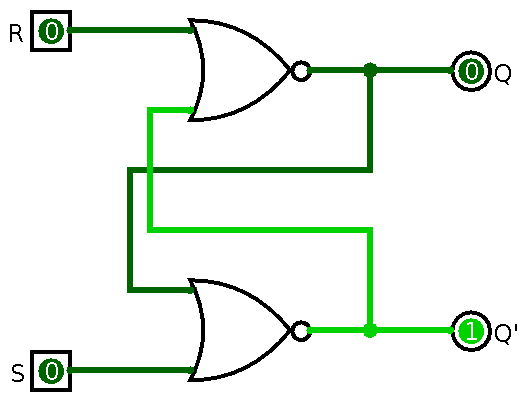
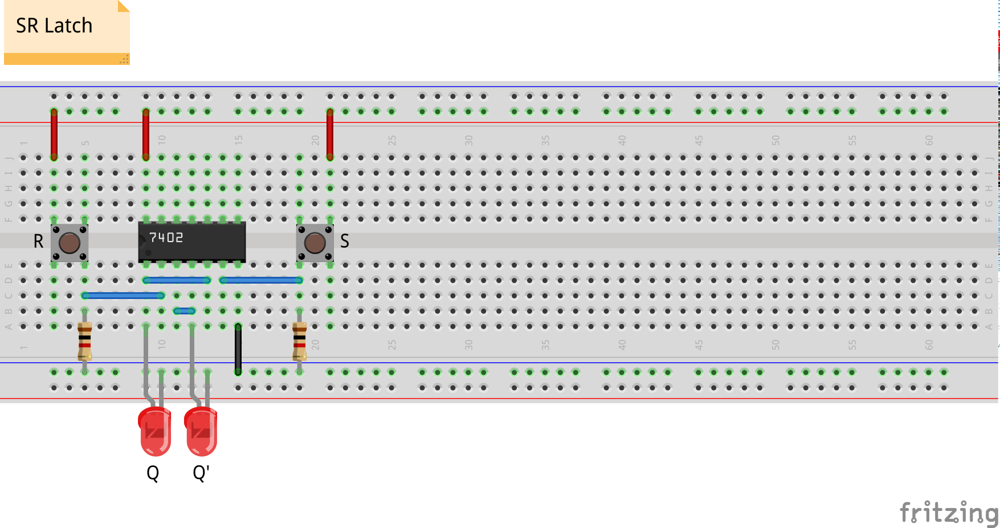
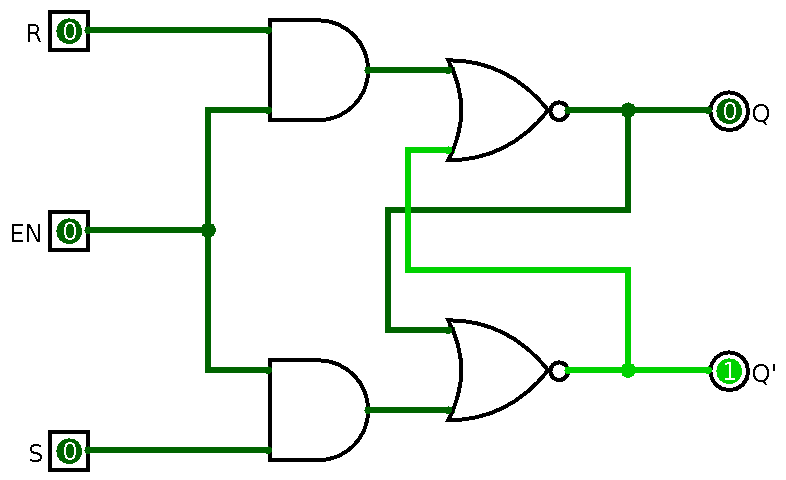
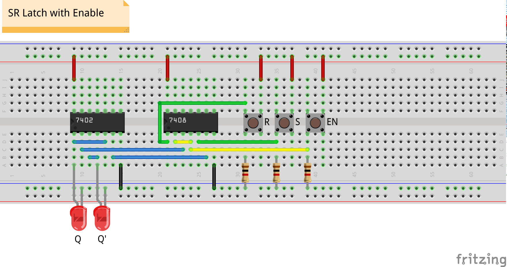
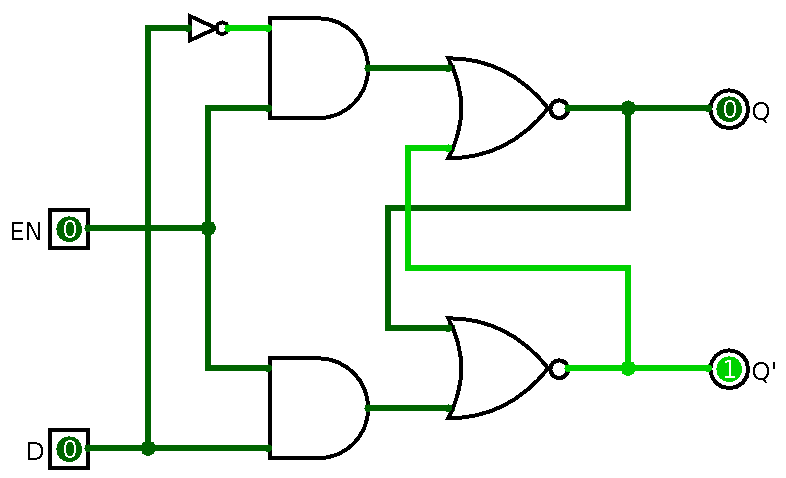
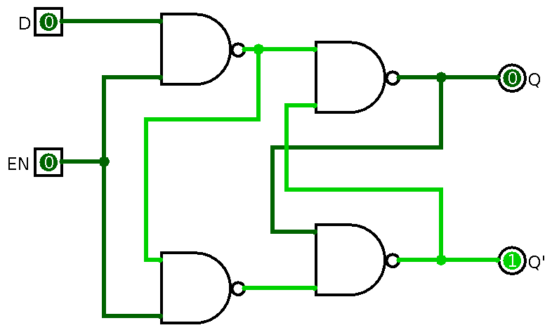
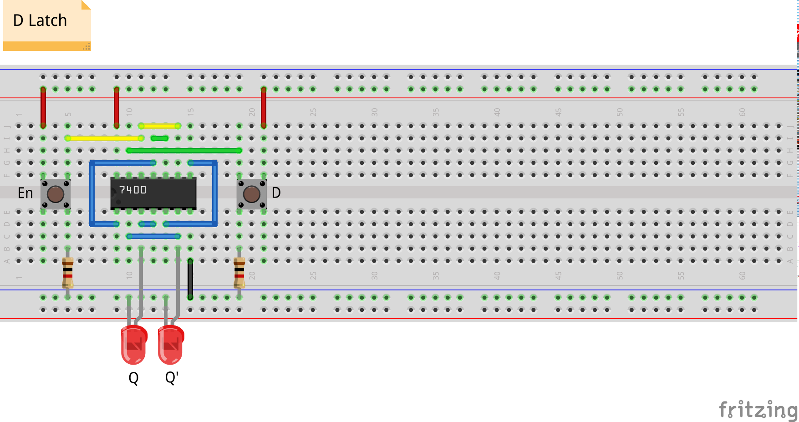

## Elemen Memori

- elemen memori adalah rangkaian digital yang:
    - dapat menyimpan *state* biner selamanya[^1]
    - dapat berubah *state* jika diberikan sinyal masukan
- jenis:
    - *latch*: bekerja pada level sinyal (*asynchronous*)
    - *flip-flop*: bekerja saat transisi *clock* (*synchronous*)
- *latch* adalah rangkaian dasar penyusun *flip-flop*

[^1]: selama rangkaian dialiri listrik

# Set-Reset (SR) Latch

## Tabel Kebenaran

 $S$     $R$     $Q_{t+1}$
-----   -----   ----------  -------------
0       0       $Q_t$       *No change*
0       1       0           *Reset*
1       0       1           *Set*
1       1       --          *Invalid*

## Simulasi

\centering

{height=60%}

## Breadboard

# SR Latch with Enable

## Tabel Kebenaran

 $En$    $S$     $R$     $Q_{t+1}$
------  -----   -----   ----------  -------------
0       X       X       $Q_t$       *No change*
1       0       0       $Q_t$       *No change*
1       0       1       0           *Reset*
1       1       0       1           *Set*
1       1       1       --          *Invalid*

## Simulasi

\centering

{height=60%}

## Breadboard

# Data (D) Latch

## Tabel Kebenaran

 $En$    $D$     $Q_{t+1}$
------  -----   ----------  -------------
0       X       $Q_t$       *No change*
1       0       0           *Reset*
1       1       1           *Set*

- D latch menghindari kondisi invalid pada SR latch
- masukan $S$ dan $R$ disatukan dan selalu komplemen

## Simulasi

\centering

{height=60%}

## Simulasi (NAND)

\centering

{height=60%}

## Breadboard

# Tugas

## Simulasi dan Implementasi Latch

- Buat simulasi pada Logisim:
    - SR latch
    - SR latch with enable
    - D latch
    - D latch (NAND)
- Implementasikan pada *breadboard*:
    - SR latch
    - SR latch with enable
    - D latch
- Penilaian langsung pada saat praktikum oleh asprak
