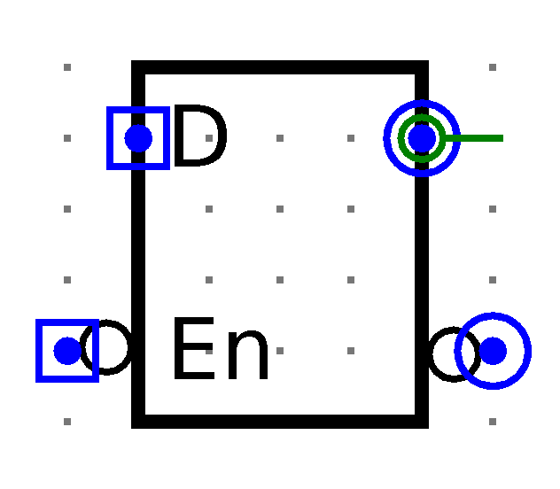
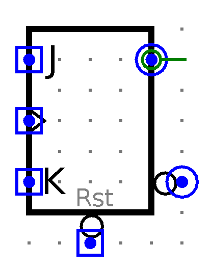
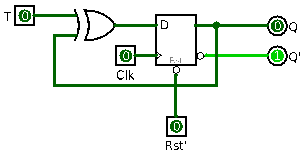

## Flip-Flop

- *latch* bekerja pada level sinyal:
    - *state* dapat berubah selama sinyal kontrol aktif
    - operasi tidak *reliable*
- *flip-flop* hanya bekerja saat transisi sinyal:
    - *positive-edge*: dari *low* ke *high*
    - *negative-edge*: dari *high* ke *low*
    - *state* stabil, hanya berubah pada saat transisi sinyal

# D Flip-Flop

## Tabel Karakteristik

 $D$     $Q_{t+1}$
-----   ----------- -------------
0       0           *Reset*
1       1           *Set*

## Simulasi: D Flip-Flop

{height=80%}

## Simulasi: D Flip-Flop with Asynchronous Reset

{height=90%}

## Simulasi: D Flip-Flop with Asynchronous Reset (IC)

{height=60%}

<!--

# D Flip-Flop Master-Slave

## Simulasi: D Latch Active-High

{height=60%}

## Simulasi: D Latch Active-High (IC)

{height=60%}

## Simulasi: D Latch Active-Low

{height=60%}

## Simulasi: D Latch Active-Low (IC)

{height=60%}

## Simulasi: D Flip-Flop Master-Slave Negative-Edge

{height=60%}

## Simulasi: D Flip-Flop Master-Slave Positive-Edge

{height=60%}

-->

# JK Flip-Flop

## Tabel Karakteristik

 $J$     $K$     $Q_{t+1}$
-----   -----   ----------- -------------
0       0       $Q_t$       *No change*
0       1       0           *Reset*
1       0       1           *Set*
1       1       $Q_t'$      *Complement*

## Simulasi: JK Flip-Flop

{height=60%}

## Simulasi: JK Flip-Flop (IC)

{height=60%}

# T Flip-Flop

## Tabel Karakteristik

 $T$     $Q_{t+1}$
-----   ----------- -------------
0       $Q_t$       *No change*
1       $Q_t'$      *Complement*

## Simulasi: T Flip-Flop

{height=60%}

## Simulasi: T Flip-Flop (IC)

{height=60%}

# Implementasi

## Clock Generator[^555]

{height=50%}

[^555]: <http://www.ohmslawcalculator.com/555-astable-calculator>

$R_1$ = 1 k$\Omega$, $R_2$ = 10 M$\Omega$,$C$ = 100 nF \
$\rightarrow$ $T$ = 1.4 s

## Clock Generator

## D Flip-Flop

## T Flip-Flop

# Tugas

## Simulasi dan Implementasi Flip-Flop

- Buat simulasi pada Logisim:
    <!-- - D flip-flop (master-slave positive-edge)-->
    - D flip-flop (with reset)
    - JK flip-flop
    - T flip-flop
- Implementasikan pada *breadboard*:
    - clock generator
    - D flip-flop
    - T flip-flop
- Penilaian langsung pada saat praktikum oleh asprak

