# Binary Counter

## Counter 4-Bit

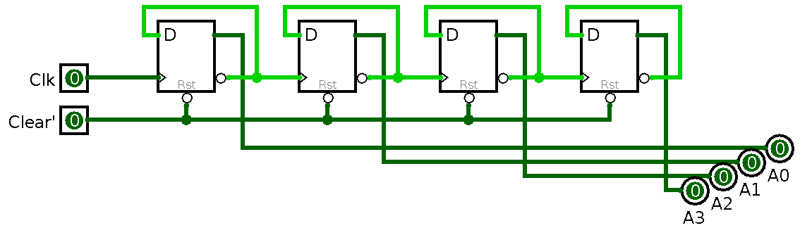

## Counter 4-Bit

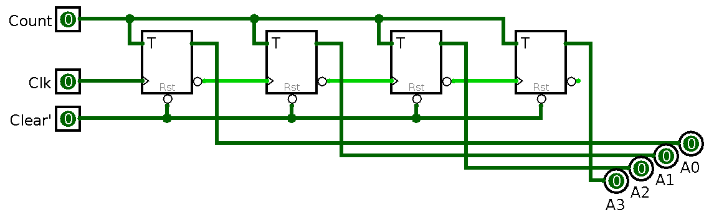

## Counter 4-Bit (IC)

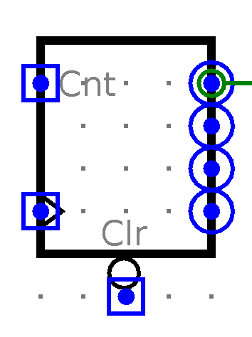{height=60%}

## Test Counter 8-Bit

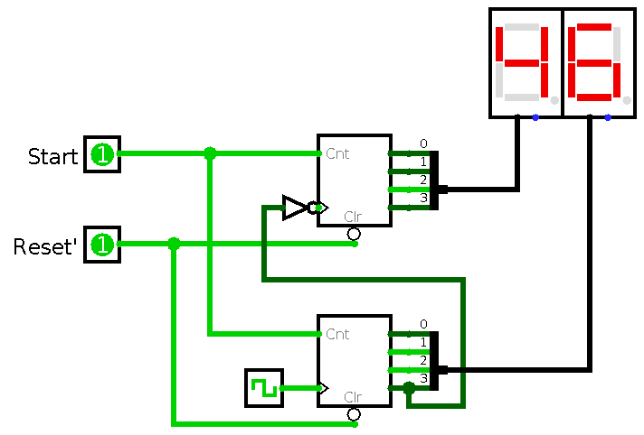{height=60%}

## *Frequency Divider*

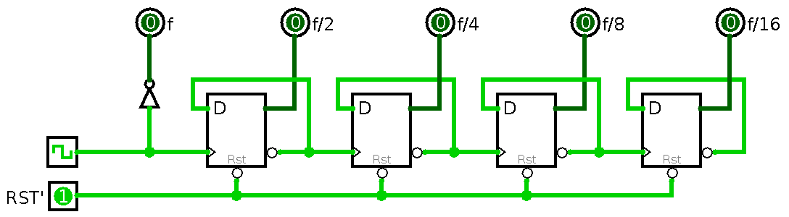

- Prinsip kerja *binary counter* adalah dengan memakai *flip-flop* untuk membagi frekuensi *clock* menjadi dua.
- Jika frekuensi *clock* 16 Hz, maka
    - frekuensi keluaran *flip-flop* pertama adalah 8 Hz
    - frekuensi keluaran *flip-flop* kedua adalah 4 Hz
    - frekuensi keluaran *flip-flop* ketiga adalah 2 Hz
    - dan seterusnya...

# Decimal Counter

## Decimal Counter

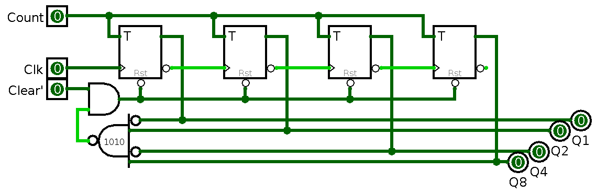

- Setiap nilai *counter* mencapai `1010`, akan di-*reset* ke `0000`

## Decimal Counter (IC)

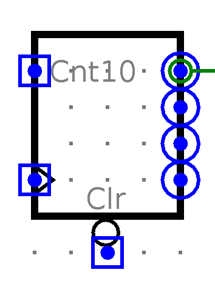{height=60%}

## Test Decimal Counter 3-Digit

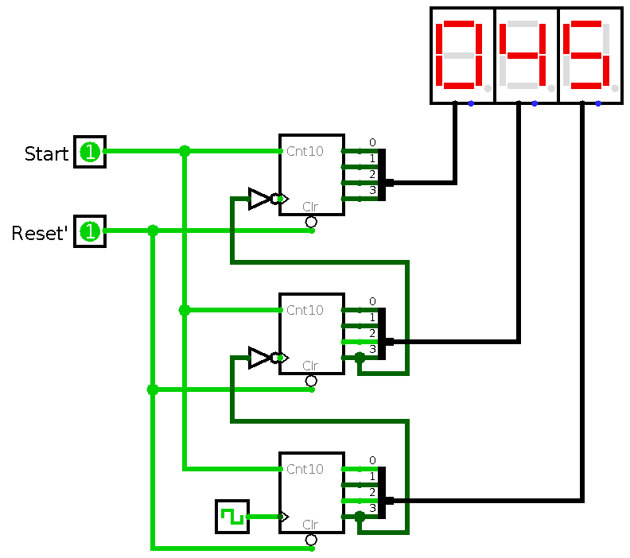{height=80%}

# Implementasi

## Clock Generator

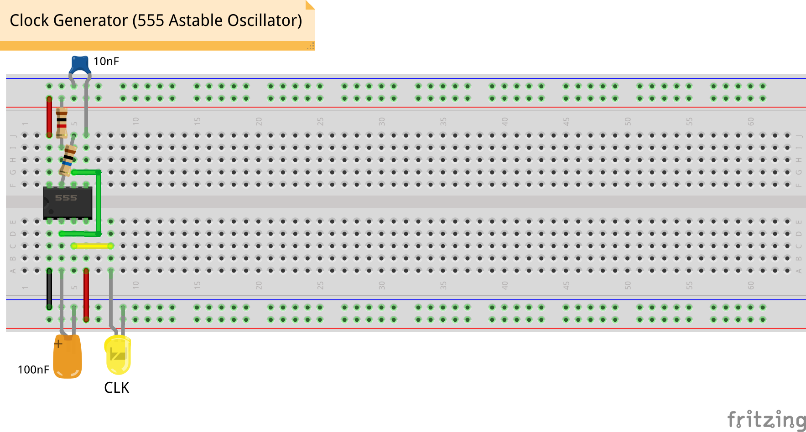

## Counter 2-Bit

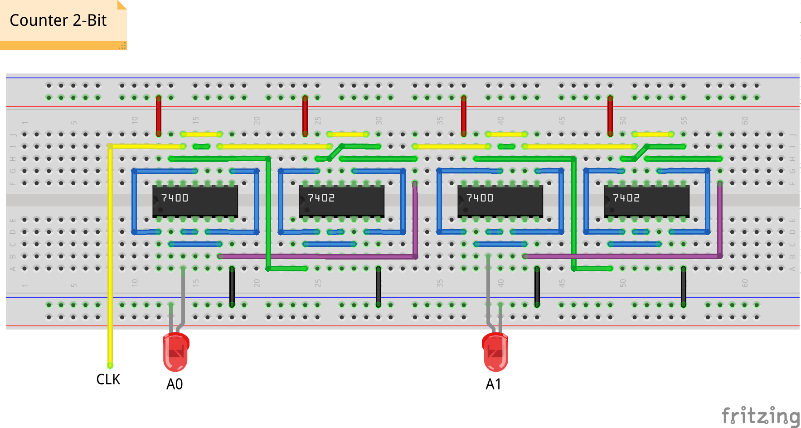

## Counter 2-Bit

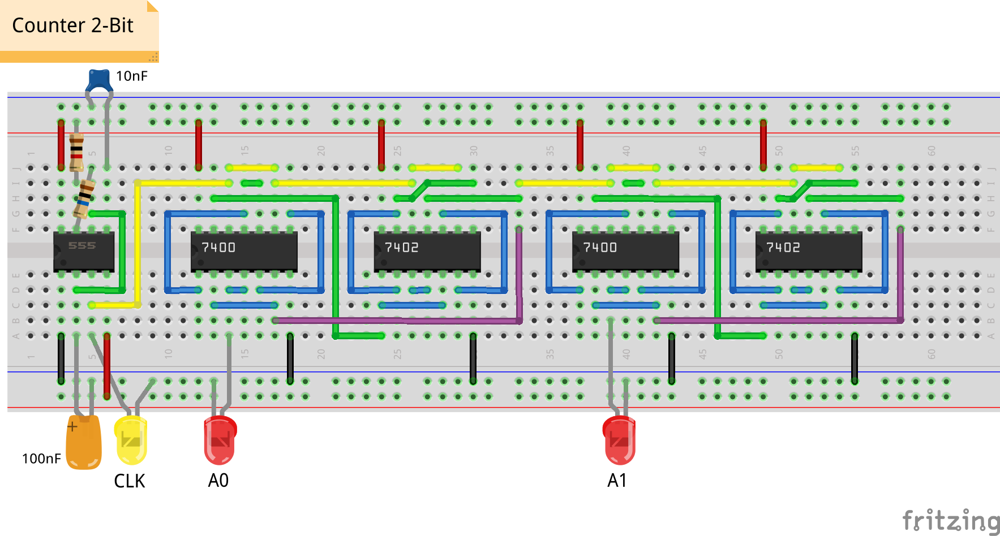

## Counter 4-Bit

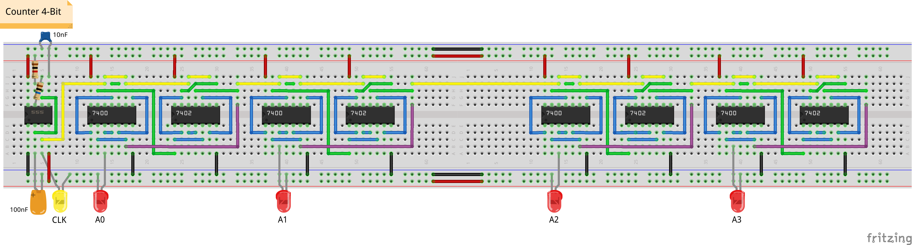

# Tugas

## Kuis LMS

Ada dua jenis jam: mekanik dan elektronik.

Jam elektronik bekerja dengan menggunakan osilasi kristal *quartz* sebagai *clock* untuk menghitung waktu per detiknya.
Temukan jawaban pertanyaan berikut di Wikipedia atau sumber lainnya.

1. Berapa frekuensi kristal *quartz* ini?
2. Berapa *flip-flop* yang dibutuhkan untuk menghasilkan keluaran frekuensi 1 Hz?

## Simulasi dan Implementasi Counter

- Buat simulasi pada Logisim (gunakan templat di LMS):
    <!-- - counter 4-bit (DFF) -->
    - counter 4-bit
    <!-- - counter desimal -->
    - test counter 8-bit

<!--
    - test counter desimal 3-digit
- Implementasikan pada *breadboard*:
    - counter 2-bit
-->

- Penilaian langsung pada saat praktikum oleh asprak

<!--
## Video Demo Counter 4-bit

- Dua kelompok
    - 1--2, 3--4, ...
- Buat video demo counter 4-bit
    - tanpa musik, tanpa selfie, fokus ke rangkaian
    - upload ke Youtube, submit *link*-nya ke LMS
    - paling lambat H+7
-->
